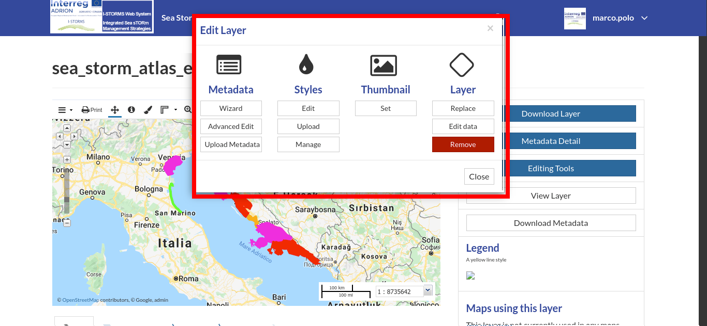
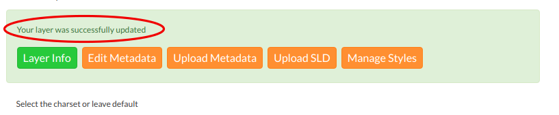
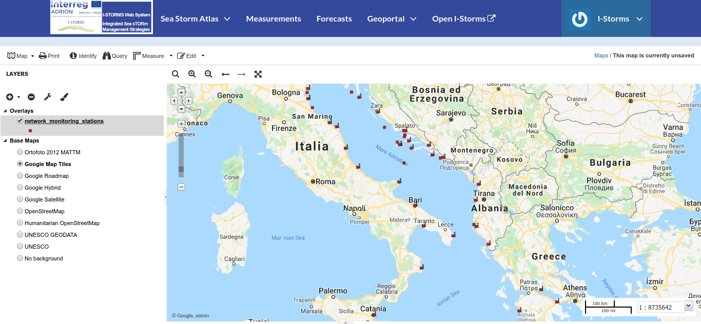
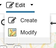

.. _layer-editing:

Layer Editing
=============

The :guilabel:`Editing Tools` button of the *Layer Page* (see :ref:`layer-info`) opens a panel like the one shown in the picture below.

     *The Layer Editing panel*

In that panel you can see many options grouped by four categories:

1. *Metadata*
2. *Styles*
3. *Thumbnail*
4. *Layer*

In this section you will learn how to edit a *Layer*, how to replace and edit its data. See :ref:`layer-metadata` to learn how to explore the layer *Metadata*, how to upload and edit them. The *Styles* will be covered in a dedicated section, see :ref:`layer-style`.

Setting the Layer Thumbnail
---------------------------

| The Thumbnail of the layer that will be displayed on the *Layers* list page can be changed by dragging and zooming on the layer preview to select which portion will be displayed, then by clicking on the :guilabel:`Set` button of the *Layer Editing* panel.
| A message will confirm the thumbnail has been correctly changed.

Replacing the Layer
-------------------

From the *Layer Editing* panel click on :guilabel:`Replace` to change the layer source dataset. You will be driven to the *Replace Layer* page in which :guilabel:`Choose Files` button allows you to select files from your disk. The *Replace Layer* page has the same interface described in :ref:`uploading-layers` section.

Once the *Charset* selected the upload process can be triggered by clicking on :guilabel:`Replace Layer`. If no errors occur you will see a message like the one in the picture below.

     *Replace Layer success*

Editing the Layer Data
----------------------

The :guilabel:`Edit data` button of the *Layer Editing* panel opens the *Layer* within a *Map*.

     *Map view for editing layer data*

Click the *Edit* button on the toolbar and select the *Create* or *Modify* from dropdown to start an editing session.

    *The Edit tool in the map viever toolbar*

Now you can:

* *Add new Features*

  If you've choosen *Create* entry it is possible to set up a new feature for your layer. Just click on the map to draw a geometry.
  Qhen you've created the new geometry it opens a popup with the attributes of the layer in use. Fill the attributes fields and click :guilabel:`Save` to save your change.

  .. figure:: img/add_new_feature.png
       :align: center

       *The attribute popup on new feature*

  .. note:: When your new feature has a multi-vertex shape you have to double-click the last vertex to finish the drawing.

* *Change the Feature Shape*

  If you've choosen the *Modify* entry you can edit the shape of an existing geometry dragging its vertices with the mouse. First click on the gometry you want to edit and in the subsqquante popup select :guilabel:`Edit `button, At this point the vertices are shown with a white square

  .. figure:: img/edit_feature.png
       :align: center

       *The popup on new feature*

* *Delete Features*

  If you want to delete a feature just select :guilabel:`Delete` botton in the popup after you've selected the feature

* *Change the Feature Attributes*

  When you are in *Edit Mode* you can also edit the attributes values changing them directly in the corresponding text fields of the popup.

