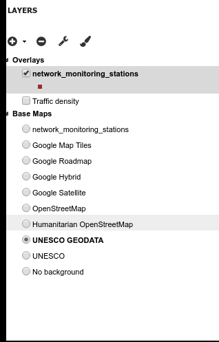
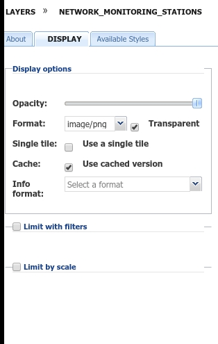
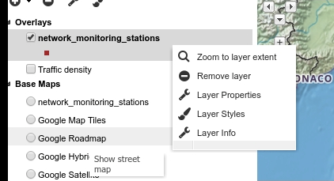

.. _toc:

Table of Contents (TOC)
=======================

In the upper left corner, click on |toc_button| to open the *Table Of Contents*, briefly *TOC* from now on, of the map.
The *TOC* shows all the layers involved with the *Map* and allows to manage their properties and representations on the map.

     *The Table Of Contents (TOC)*

From the *TOC* you can:

* toggle visibility of each layer of overlay group by clicking the checkbox on the left of layer name;
* change basemap by selecting the radio button (only one basemap can be selected at once);
* change the layers *Display order* dragging a layer upwards or downwards;
* add new layers from the *Catalog* by clicking the :guilabel:`Add Layer` button |add_layer_button|;
* remove layers from the map by clicking the :guilabel:`Remove Layer` button |remove_layer_button|;
* manage the layers properties such as *Opacity* (scroll the opacity cursor), opening the :guilabel:`Layer properties` panel

Select a *Layer* from the list and click on it, the layer title will be outlined in gray.
Click on the :guilabel:`Layer properties` button |layer_properties_button|

In the first tab :guilabel:`About` you can change the Layer title for this map.

In the second tab :guilabel:`Display` you can set opacity of the layer and limit feature visibility by a filter condition or by scale

     *The Display tab of properties panel*

In the third tab :guilabel:`Available Styles` you can change the stile from those associated to the layer.
You can also add new styles and edit existing styles clicking on the :guilabel:`Layer Styles` button |layer_styles_button|.
For further information in editing styles see :ref:`layer-style` section.

These commands and also the :guilabel:`Zoom to layer extent` option are available in the context menu by right-clicking on the layer title.

     *The Layer Context Menu*

