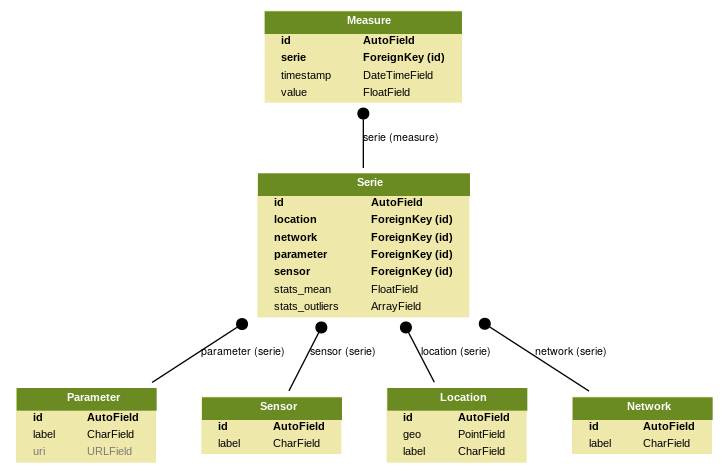
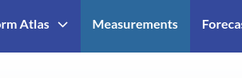
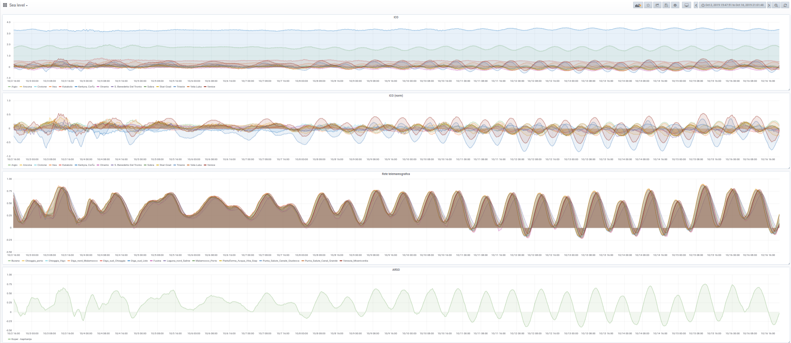
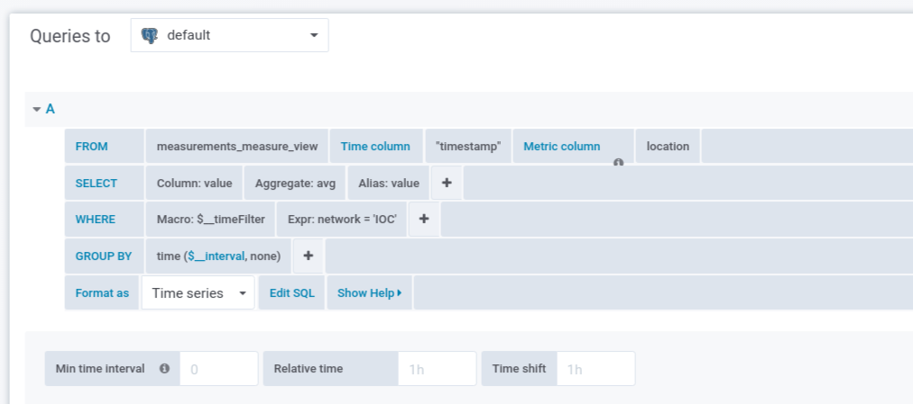

About Measurements
==================

A joint asset which could be exploited through fruitful cooperation is
the presence in the whole Adriatic-Ionian coastal territories of large
networks of sensors and stations. In the Adriatic region, we mapped 35
tide gauges (9 inside the Venice Lagoon) and 9 wave stations, with the
highest concentration in the northern Adriatic Sea.

The *Common Data Sharing System (CDSS)* allows for aggregating the
observed data from several monitoring network.  The aggregating
approach for collecting and sharing observations is crucial for
providing real-time information about the sea state - and its
evolution - to be used by several countries for prompt emergency
response and to increase the overall preparedness to sea storms.

CDSS collects and harmonizes monitoring network time-series storing
them into a common data model (Measurements application) which
provides management functionalities as well. Archived data are organized into the following structure:

:Network:
   environmental monitoring networks (e.g. Rete Meteomarina). Denomination and basic information related to the operational monitoring networks.

:Sensor:
   sensor label and main characteristics.

:Location:
   geographic location (point) where sensors are located. A single location may host one or more sensors.

:Parameter:
   denomination of the acquired parameter

:Serie:
   rapresent a collection of data that share a network, sensor, location and parameter. Serie object may contain statistics on the serie of data (es. mean sea level value).

:Measure:
   single measure composed by a serie, timestamp (in UCT) and a value.

Entity-Relationship Diagram (ERD) of the common data model of the Measurements application (part of the CDSS).

In order to query, visualize and share measurement datasets and
time-series, IWS provides a high-level graphical interfaces based on
`Grafana <https://grafana.com>`_ dashboard and graph composer.
Grafana is a multi-platform and Open Source Software which allows
users to create and share interactive interfaces (dashboards)
collecting and aggregating time series data from multiple data sources.

A Grafana dashboard aggregates basic visualization blocks called
panels. There are currently five Panel types: Graph, Singlestat,
Dashlist, Table, and Text. Panels like the Graph panel allow you to
graph as many metrics and series as you want. Other panels like
Singlestat require a reduction of a single query into a single
number. Dashlist and Text are special panels that do not connect to
any Data Source. Additional information are available on `Grafana documentation <https://grafana.com/docs/>`_.

IWS publishes a default dashboard (menu "Measurements") which offers a
synoptic view of tide and wave measurement data collected by the platform.
Such dashboard is available following the "Measurements" menu.

Example of IWS sea level synoptic dashboard. The sea level time series are grouped by monitoring network.

Visualized data are directly collected from  CDSS using the Query Editor tool provided bu Grafana. Query Editor provides a high-level interface for querying stored time series.

In the previous example, Query Editor queries directly a convenient
data view called "measurements_measure_view" which exposes all
relevant data provided by "Measurements" application.
"measurements_measure_view" has the following structure:

* id: id of the measure
* timestamp: time of measure in UTC
* value: value of the measure
* value_norm: normalized value of the measure (for sea level parameter)
* location: label identifying a location of the measure
* parameter: label identifying the parameter
* network: label identifying the monitoring network

..
   CDDS provides access to the stored resources through standardized interfaces (e.g OGC-Web service, web API). A core set of OGC web services and other protocols and standards commonly used
   in the field of Atmospheric and Marine Sciences have be implemented:

    * OGC Web Feature Service (OGC-WFS, OGCI2005): standard interface to request and download geographical features across the web;
    *  OGC Web Coverage Service (OGC-WCS, OGCI2008): standard interface to request and download coverages that is, digital geospatial information representing space/time-varying phenomena;
    *  OGC Sensor Observation Service (OGC-SOS, OGCI2012a): standard interface to request and download real-time sensor data and sensor data time series;
    *  OGC portrayal service (e.g. Web Map Service, OGCI2006; Tile Map  *  Service, OGCI2012b; Web  *  Map Tiling Service, OGCI2010): standard interfaces to visualize the geospatial datasets;
    * OGC Catalogue Service for the Web (CS-W; OGCI2007): standard for exposing a catalogue of geospatial resources;
    * Data Access Protocol (DAP; GPSHF2004): protocol designed for the efficient transmission of scientific data over the internet.

   In addition, the Common Data Sharing System will implement dedicated I-STORMS
   API for easily supporting IWS functionalities. Such API will follow the Open API
   Specification (OAO2014).

   .. rubric:: References

   .. [OGCI2005] Open Geospatial Consortium Inc., 2005. Web Feature Service Implementation Specification.
   .. [OGCI2006] Open Geospatial Consortium Inc., 2006. OpenGIS Web Map Server Implementation Specification.
   .. [OGCI2007] Open Geospatial Consortium Inc., 2007. OpenGIS Catalogue Services Specification.ication.
   .. [OGCI2008] Open Geospatial Consortium Inc., 2008. Web Coverage Service (WCS) Implementation Standard.
   .. [OGCI2010] Open Geospatial Consortium Inc., 2010b. Web Map Tile Service Implementation Standard.
   .. [OGCI2012a] Open Geospatial Consortium Inc., 2012. OGC Sensor Observation Service Interface Standard.
   .. [OGCI2012b] Open Geospatial Consortium Inc., 2012.. Tile Map Service Specification - OSGeo [WWW Document].
   .. [GPSHF2004] Gallagher, J., Potter, N., Sgouros, T., Hankin, S., Flierl, G., 2004. The data access protocol—DAP 2.0. Httpwww Opendap Org.
   .. [OAO2014] Open API Initiative, 2014. OpenAPI Specification.
