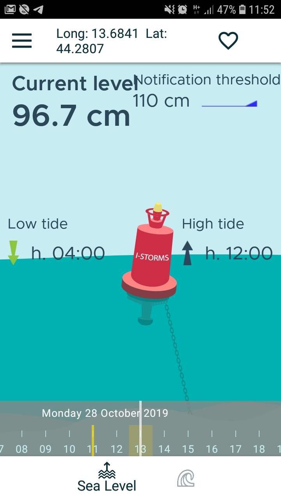
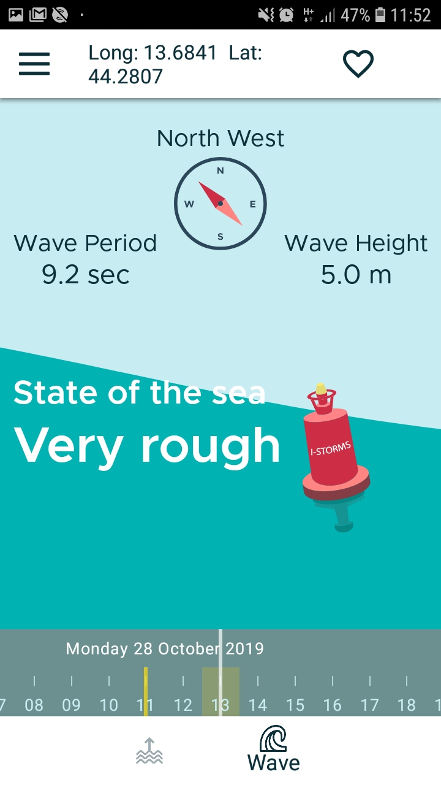

.. _istorms-modile-app:

I-STORMS mobile APP
===================

Alogside the Open I-STORMS Web Applicazion a mobile APP has been developed for the general public.

First of all the mobile user must select one geographic location to investigate, the the APP presents the TMES forecast for that location.

THe APP has two main views for Sea Level and Wave. In each views sudo

* On the Sea Level view is summarized the current forecast, the next peaks (low and high) and the threshold defined by the user in the *APP settings*..

        *The APP sea level view*

On the Waves view tha state of the sea is represented by an animation of the sea surface and is printed the Waves mean direction, the wave significant Height (mean) and the waves mean period (mean) form TMES

        *The APP waves view*
