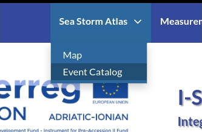

About the Atlas
===============

All information on coastal disaster due to sea storm events (historical and
more recent) are organized and mapped in geospatial layers which constitute
the Sea Storms Atlas. That series can be used to draw the map of risk
characterization of the coast with the aim of identifying the most vulnerable
areas and supporting the planning of coastal area use and development.

The Sea Storm Atlas is presented in form of a map that summarize the Sea Storms Events occurred by region and/or by year, and an Event Catalog presented by several web pages. The Sea Storms Atlas is a dynamic repository and can be expanded and enriched anytime.

Sea Storm Atlas Map
-------------------

To access the Storm Atlas Map select the :guilabel:`Map` entry from the :guilabel:`Sea Storm Atlas` menu.

    *Link to Atlas map*

In the Atlas map the records that contains single Storm events are represented as points in the *Storm Event* Layer.
Also the regional coastal segments are represented in the *Coastal Segements* layer.
Each feature can be queried with the :guilabel:`identify` tool.

see also the :ref:`exploring-maps` section of this manual for more information about querying the map content.

Sea Storm Atlas Event Catalog
-----------------------------
To browse the Storm Event Catalog select the :guilabel:`Event Catalog` entry from the :guilabel:`Sea Storm Atlas` menu.

    *Link to Atlas catalog*

At the subsequent page you can select a region from the list to view the information about the corrispondent coastal segment.

    *Regional Coastal segments list*

The Region page contains the informations collected about the risks,  civil protection procedures, early warning systems in the selected region.

    *Information about selected Region and Subregion*

From the Region page you can view the event list or insert a new event clicking on the buttons of the sidebar
The Event list can contains *aggregated events* or *single events* depending on the data available.

    *Storm event list aggregated by year*

    *Single events with date and geographic location*

By clicking on the event record you can obtain further informations and related documents.

    *Sea storm atals event record (aggregated)*