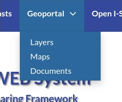

.. _about_geoportal:

About the Geoportal
===================

The Geoportal identifies the end-user web interface of the IWS. The geoportal
provides interactive tools in order to search, visualize, explore and download
observation datasets and forecast outputs capitalizing on existing experiences in
the ADRION area (ADRIPLAN, SHAPE, HAZADR projects).

The Geoportal is based on `Geonode <http://geonode.org/>`_ extended with customized dajngo apps and dedicated interfaces.

 1. The Map Viewer and Composer is a native Geonode feature and provides an interactive and dedicated GUI for creating, managing and sharing multi-layered maps and for navigating and querying them. The complete list of supported functionalities is reported in Section `managing_maps “Managing Maps”`_.
 2. Differently, the I-STORMS Interactive Viewer is a specialized GUI which offers a simultaneous visualization and exploration of multiple forecast model outputs and monitoring sensor networks time-series. The I-STORMS Interactive Viewer represents the more characteristic GUI of the IWS and supports Open I-STORMS and Sea Storm Atlas functionalities.

| There are three main types of resources that GeoNode can manage:

#. Layers
#. Maps
#. Documents

All of them  can be accessed from the :guilabel:`Geoportal` menu of the navigation bar.

     *Geoportal menu*

The :guilabel:`People` and :guilabel:`Groups` menus are also part of standard Geonode features but they are described in the :ref:`users_groups` section.

Layers
------

| Layers are publishable resources representing a raster or vector spatial data source. Layers also can be associated with metadata, ratings, and comments.

| By clicking the Layers link you will get a list of all published layers. If logged in as an administrator, you will also see the unpublished layers in the same list.
| IWS/GeoNode allows the user to upload vector and raster data in their original projections using a web form.

Vector data can be uploaded in many different formats (ESRI Shapefile, KML and so on...). When uploading ESRI Shapefile format please be sure to provide all the mandatory files (at least .shp, .dbf, .shx, .prj). Satellite imagery and other kinds of raster data can be uploaded as GeoTIFFs.

Maps
----

| Maps are comprised of various layers and their styles. Layers can be both local layers in IWS as well as remote layers either served from other WMS servers or by web service layers such as Google or MapQuest.

You can create a map based on uploaded layers, combine them with some existing layers and a remote web service layer.
If your user has the permission to do that you can also save the created map and share with other users or made it publicly available in the IWS Geoportal.

Documents
---------

| IWS/GeoNode allows to publish tabular and text data and to manage metadata and associated documents.
| Documents can be uploaded directly from your disk (see :ref:`uploading-documents` for further information).
| The following documents types are allowed: `.doc, .docx, .gif, .jpg, .jpeg, .ods, .odt, .odp, .pdf, .png, .ppt, .pptx, .rar, .sld, .tif, .tiff, .txt, .xls, .xlsx, .xml, .zip, .gz, .qml`.
| Through the document detailed page is possible to view, download and manage a document.
| Documents can also be linked to existing objects like maps, layers and also the Storm Atlas events.

