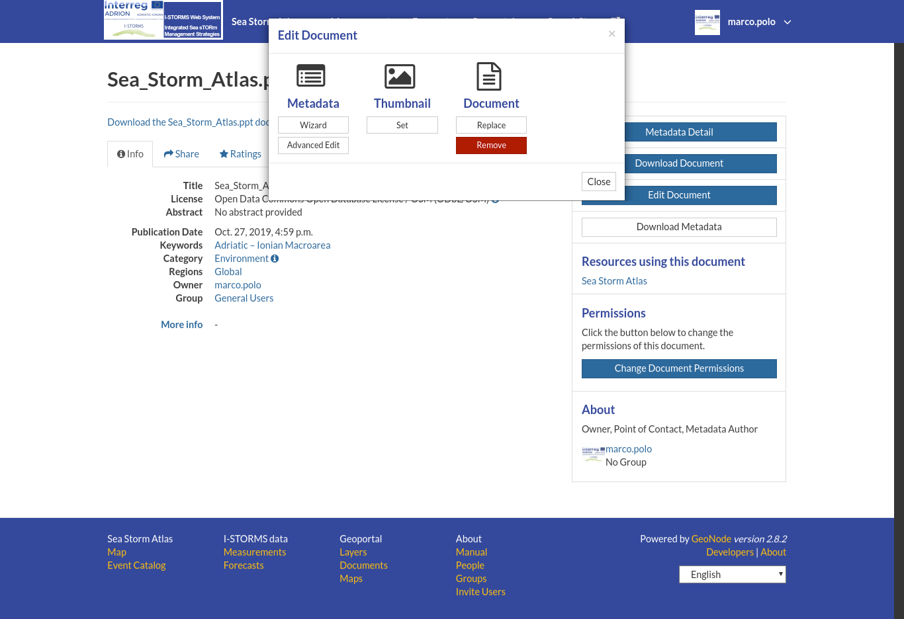

.. _document-editing:

Document Editing
================

The :ref:`document-info` page makes available useful tools for document editing. Click on the :guilabel:`Edit Document` button to see what you can do to make changes. The picture below shows you the *Editing Panel* that will appear on the screen.

    *Document Editing panel*

You can *Replace* the document file with another one by clicking on :guilabel:`Replace`. It will drive you to the *Document Upload* page (see :ref:`uploading-documents`) where you can upload a new file.

The :guilabel:`Remove` button allows you to delete the document. You will have to confirm that choice.

The *Editing Panel* shows you also some links for editing the metadata and the thumbnail. These actions are quite simalr to those already explained for :ref:`layer-editing`.

