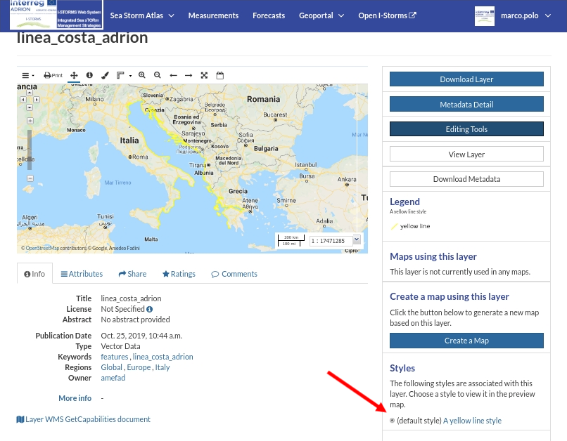
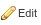
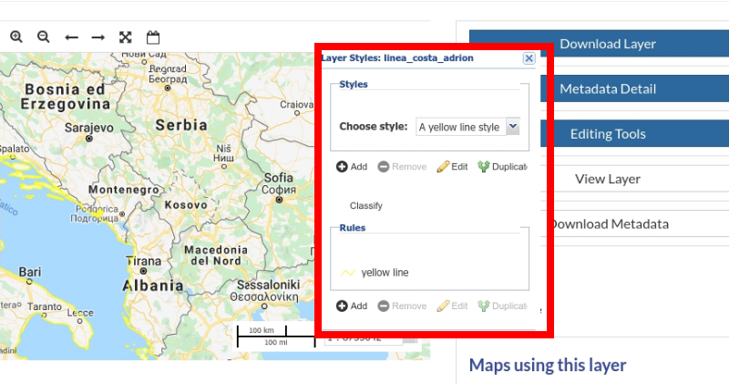

.. _layer-style:

Layer Styling
=============

Maps are helpful because they allow you gain a deeper understanding of your data by allowing you to visualize it in many different ways.
So you can tell different stories depending on how the data is presented.
For any given data or layer, you should explore different styling options and choose the best style for that.

In GeoNode each layer has a *Default Style* which is determined by the nature of the data you're mapping. When uploading a new layer (see :ref:`uploading-layers`) a new default style will be associated to it.

     *Default Style for Layers*

Referring to the example above, dark orange lines are not very good to represent waterways so we would need to change this style. In the following paragraphs you will learn how to create a new style starting from given templates, how to edit a style, how to upload styles from file and how to manage them.

Editing Styles and creating new Styles
-------------------

In order to create a new style, open the *Layer Page* (see :ref:`layer-info`) and click on :guilabel:`Editing Tools`. Then click the :guilabel:`Edit` button in the *Styles* section of the *Layer Editing* panel (see the picture below).

     *Edit Styles button*

This will open a popup in which is presented a drop-down list of :guilabel:`Styles` associated to the current layer and the :guilabel:`Rules` of the current selected Style.

     *The Styles popup*

To create a new style:

1. Click the |add_style_button| button. This will open another form in which you must insert a *Title* and an *Abstract* (optional) while the Style name is generated by IWS/Geonode, then click |save_style_button| button .

  .. figure:: img/create_new_style_panel.png
       :align: center

       *Add new Styles*

  .. |add_style_button| image:: img/add_style_button.png
       :width: 60px
       :height: 37px
       :align: middle

  .. |save_style_button| image:: img/save_style_button.png
       :width: 60px
       :height: 37px
       :align: middle

2. The new Style is added to drop-down list and a default rule is created in the :guilabel:`Rules` panel.
   Select the rule and click the |edit_style_button|

  .. |edit_style_button| image:: img/edit_style_button.png
       :width: 60px
       :height: 37px
       :align: middle

4. In the new panel there are thre tabs:

a. in the :guilabel:`basic` tab you can set the rule name, the symbol color and opacity;

  .. figure:: img/style_new_rule_basic.png
      :align: center
      :width: 300px

      *Basic settings for new rule*

b. in the :guilabel:`labels` tab you can set labelling options and appearence;.

  .. figure:: img/style_new_rule_label.png
      :align: center
      :width: 300px

      *Label settings for new rule*
c. in the :guilabel:`advanced` tab you can limit this rule to scale or different condition based on features attribute value, in this example we apply only to features that have the *Sea* atribute starting with *Adriatic* (Case sensitive) ;.

  .. figure:: img/style_new_rule_advanced.png
      :align: center
      :width: 300px

      *Advanced settings for new rule*

Editing the Layer Style
-----------------------
If you wish to edit an existing style just start from point 2 above.

Uploading Styles
----------------

In GeoNode it is also possible to upload an existing style from file.

.. warning:: Currently only styles in **SLD (Style Layer Descriptor 1.0, 1.1)** format can be uploaded in GeoNode.

From the *Layer Page* click on *Editing Tools* to open the *Editing Tools* panel and follow the steps below:

1. Click the :guilabel:`Upload` button of the *Styles* section

  .. figure:: img/upload_style_button.png
      :align: center
      :width: 400px

      *Upload Styles button*

2. Click on :guilabel:`Choose Files` and select your style from your disk

  .. figure:: img/upload_styles.png
      :align: center

      *Upload Styles*

3. Click on :guilabel:`Upload files`

Once the process has been finished the new *Style* will be visible in the *Layer Page*.

Managing Styles
---------------

Given a layer, you can manage all its styles in tha *Styles Management Page* accessible from the :guilabel:`Manage` button of the *Layer Editing* panel.

.. figure:: img/manage_styles.png
    :align: center

    *Managing Styles*

In that page you can:

* See the *Layer Name*
* Add/remove styles to/from the *Available styles* list
* Choose the *Layer Default Style* from the *Available styles* list

Click on :guilabel:`Update Available Styles` to save your changes.
