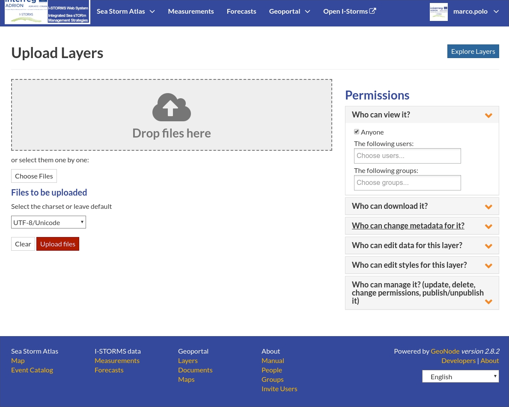
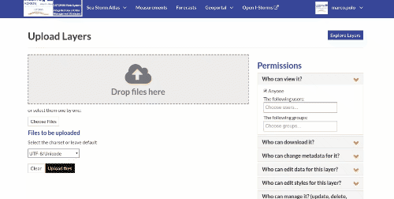

.. _uploading-layers:

Layers Uploading
================

| The *Layer* is the main resource type inside a geographic repository. A layer represents spatial information so it can be displayed inside a map.
| To better understand what we are talking about let's upload your first layer.

The *Layer Uploading* page can be reached from the :guilabel:`Upload Layer` button in the :ref:`finding-layers` page.

     *Button for Layers Uploading*

The *Layers Uploading* page looks like the one in the picture below.

     *The Layers Uploading page*

| Through the :guilabel:`Choose Files` button you can select files from your disk, make sure they are valid raster or vector spatial data. You can also change the default *Permissions* settings (see :ref:`layer-permissions` for further information on how to set permissions).
| Select the *charset*, then click on :guilabel:`Upload files` to start the process or click :guilabel:`Clear` to remove all the loaded files form the page.

     *Shapefile Uploading*

In this example the ``Mediterranean Segments`` ESRI Shapefile, with all its mandatory files (`.shp`, `.shx`, `.dbf` and `.prj`), has been chosen.
Optionally the style definition in `.sld` format and ISO metadata in `.xml` format should be also recognized.
As an alternative way you can also upload a single `.zip` archive (without  subdirectories in it) containing at least these files.
A progress bar shows the operation made during the layer upload and alerts you when the process is over.
When the process ends click the :guilabel:`Layer Info` to check the layer has been correctly uploaded.

..  note:: if you don't have the `.prj` file you can create it copyng and pasting the `OGC WKT` definition from corresponding CSR page inn `http://epsg.io/`_

In the next paragraphs you will learn how to create a layer from scratch, how to set permissions, how to explore the layer properties and how to edit them.
