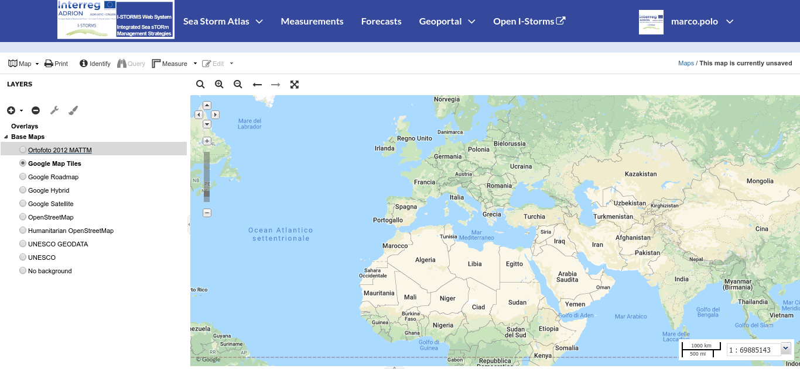
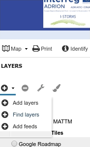
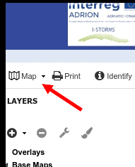

.. _creating-map:

Creating Maps
=============

In this section, we’ll create a *Map* using some uploaded layers, combine them with some other layers from remote web services, and then share the resulting map for public viewing.

In order to create new maps you have to open the :guilabel:`Maps`link from :guilabel:`Geoportal` menu in the navigation bar:

  .. figure:: img/map_list_link.png
       :align: center

       *The Maps link*

And then click on the :guilabel:`Create New Map` button in the *Explore Maps* page (creates an empty map only with base layers)

  .. figure:: img/create_new_map_button.png
      :align: center

      *The Create New Map button*

You can also click on the  :guilabel:`Create Map` button in the *Layer Page* (it creates a map starting with  a specific layer)

  .. figure:: img/create_map_button.png
       :align: center

       *The Create Map button*

The new *Map* will open in a *Map Viewer* like the one in the picture below.

     *The Map Viewer*

| On the left side there is :ref:`toc` of the *Map*. It allows to manage all the layers associated with the map and to add new ones from the *Catalog*.
| The *TOC* component makes possible to manage layers overlap on the map by shifting their relative positions in the list (drag and drop them up or down in the list).
| To toggle visibility of a layer just click on the checkbox besides the layer name.
| To add a new layer you can click on the :guilabel:`Add Layers button`.

     *Add layer button*

Selecting "local geoserver" are listed all the layers present in the Geonode geoportal. As a sources are listed also the registered remote service and basemap providers.
Once the map layers have been settled it is possible to save the *Map* by clicking on :guilabel:`Map` and choosing :guilabel:`Save Map`.

    *Map save button*

If you followed the steps above, you have just created your first *Map*.
Now you should see it in the *Explore Maps* page, see :ref:`map-info` for further details.

We will take a closer look at the *Map Viewer* tools in the :ref:`exploring-maps` section.
