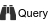
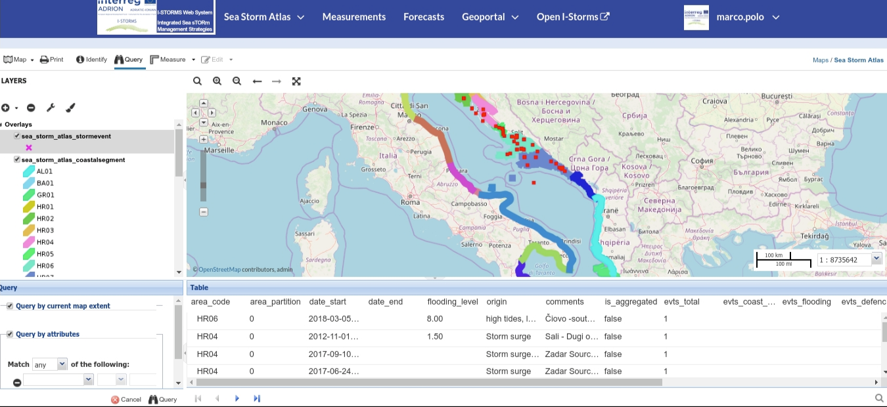
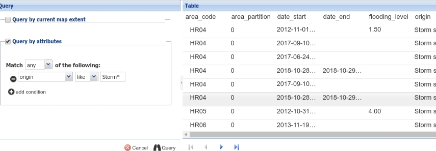
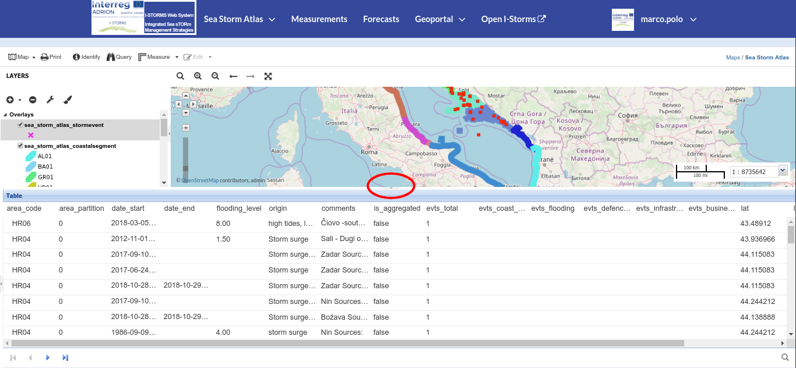

.. _attributes-table:

Attributes Table
================

When clicking on the |attribute_table_button| button of the :ref:`map-toolbar`, the *Attributes Table* panel opens at the bottom of the *Map* page and the *Query Panel* at the bottom of the :ref:`toc`.

     *The Attributes Table and Query Panels*

In that panel you can navigate through the features of the layer, explore their attributes, zoom to their geometries by selecting the line and right-click to make appear the :guilabel:`Zoom to selected features` command.

| The *Attribute Tables* has a row for each feature belonging to the layer and a column for each attribute that describes the feature.
| Each column has a *Filter* input field through which you can filter the features basing on some value or expression (depending on the data type of the field).

| On the query panel you can set a filter by one or more condition to apply on the attributes. The filter expression are always case sensitive so type exact values as they appear in the table list.

Use "=" operator for exact text values.
Use "like" operator for matching strings. The wildcard is the * character,  so  expression *origin like 'Storm\*'*  will trigger all values starting with the *Storm* characters.

    *Filtering Features by Query Extpression on the attribute*

.. note:: Always be sure that  the :guilabel:`Query by current map extent` setting has the correct value for your search, otherwise the results can be unexpected.

To close the *Attribute Table* panel deactivate the query tool |attribute_table_button| and click on the small button in the middle of the separator.

    *Small button to close the attribute table*