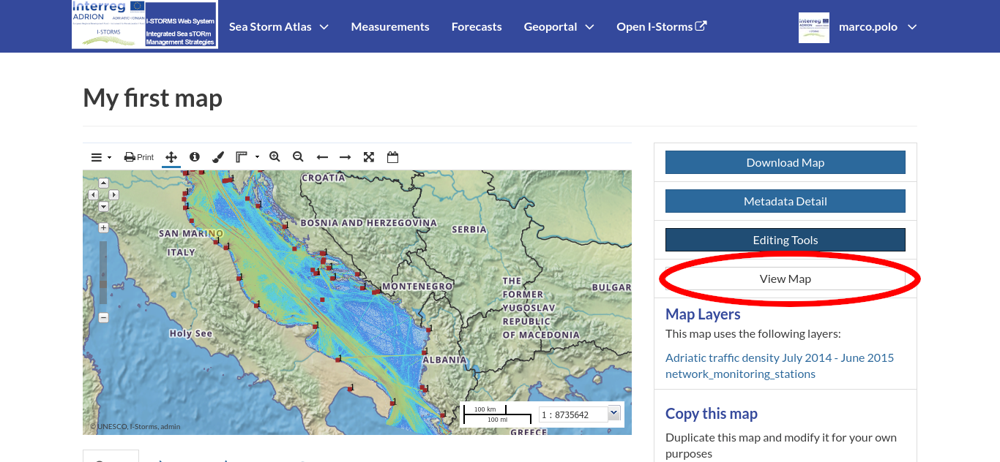
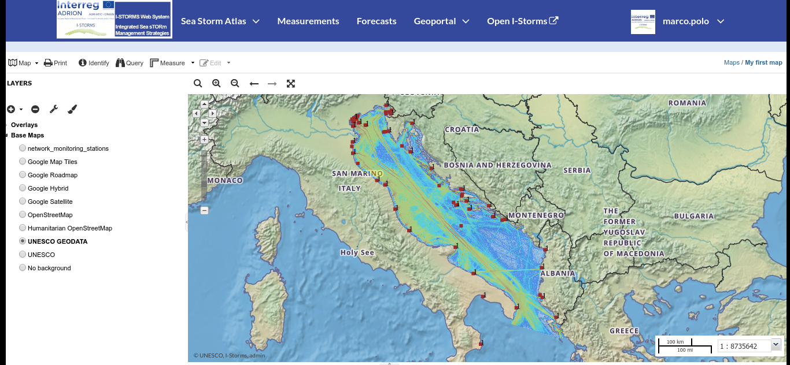

.. _exploring-maps:

Exploring Maps
==============

From the :guilabel:`Explore Maps` link of the navigation bar you can reach the *Maps List* page (see :ref:`finding-maps`).
Select a map you are interested in and click on it, the *Map Page* will open.

     *The View Map button*

Click on the :guilabel:`View Map` button to open the *Map Viewer*.

     *The Map View*

The Map Viewer provides the following tools:

* the :ref:`toc` to manage the map contents: layers are divided in two foldable groups *Overlays* and *Base Maps*;
* the :ref:`map-toolbar` which contains buttons for  *Print* tool, *Identify*, *Query* and the *Measure* tool;
* the *Sidebar* and its tools such as the *Zoom* tools and the *Get Features Info* tool;
* the *Footer Tools* to manage the scale of the map, to track the mouse coordinates and change the CRS (Coordinates Reference System).

.. toctree::
    :hidden:
    :maxdepth: 1

    toc
    attribute_table
    options_menu

    *The Zoom bar*

The *Zoom Bar* contains the following tools:

* Zoom to map area drawing a box

* Zoom in anZoom out button

* You can switch between the previous and the next zoom level.

* Zoom to max layer extent

