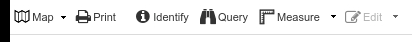
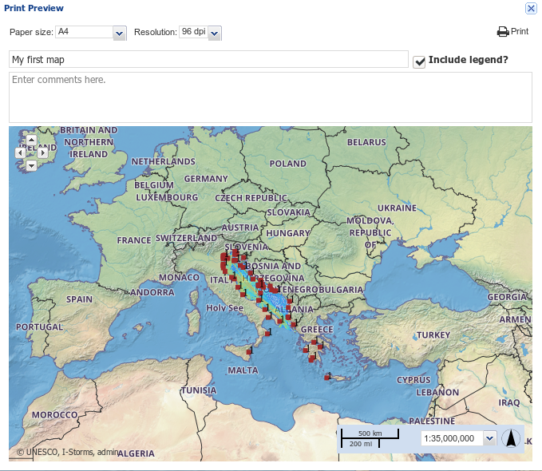
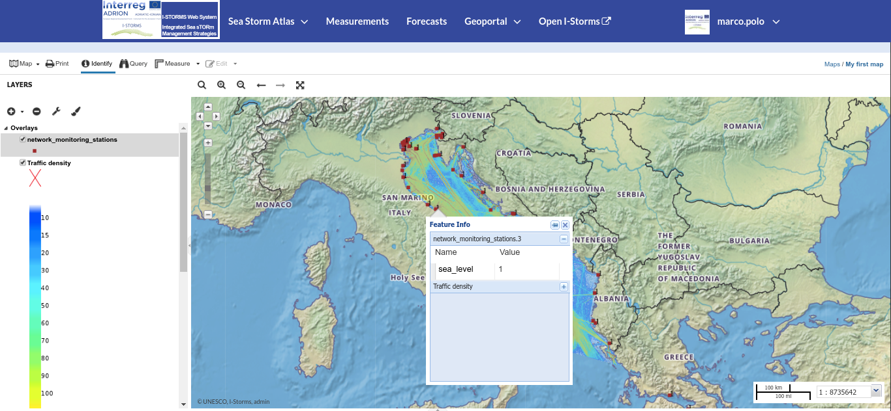
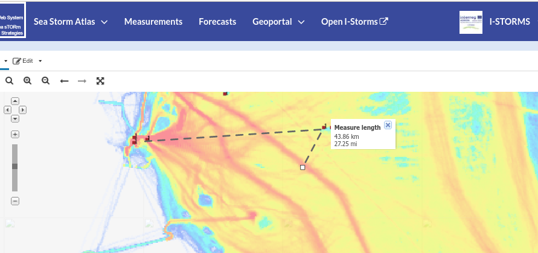
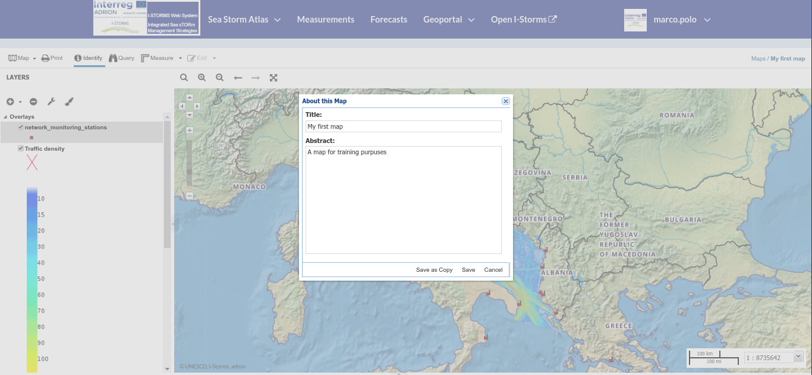

.. _map-toolbar:

Map toolbar
==================

Over the :ref:`toc` panel the map toolbar contains buttons to perform common tasks on map:

     *The Map Toolbar*

We will explain those tools more in depth in the next paragraphs.

Saving a Map
------------

When you've changed layer order or appearance, you can save the map or create a copy of it (you need right permissions to do so) by clicking the :guilabel:`map` and then :guilabel:`Save Map` Button.

Printing a Map
--------------

| The map viewer of IWS/GeoNode allows you to print your map on a A4 layout.
| Click the :guilabel:`PRINT` option from the *Map toolbar*, the **Printing Window** will open.

     *The Printing Window*

Query Map layers
------------------

With the :guilabel:

     *The Identify tool*

Performing Measurements
-----------------------

Click on the :guilabel:`MEASURE` option of the *Map toolbar* to perform a measurement.
As you can see in the picture below, this tool allows you to measure *Distances* or *Areas*.

     *The Measure Tool*

Saving a map
------------

| Once all the customizations have been carried out, you can *Save* your map by clicking on the :guilabel:`SAVE AS` option of the *Map Options Menu*.
| A new popup window will open.

     *Saving Maps*

You have to fill out a *Title* and an optional *Description*, then click on :guilabel:`Save`. The page will reload and your map should be visible in the Maps list.

