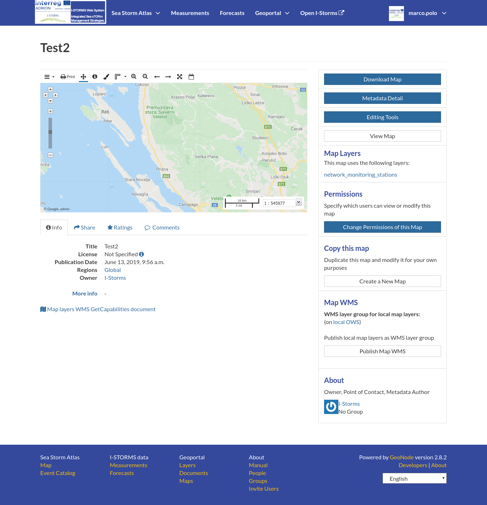

.. _map-info:

Map Information
===============

| As mentioned in the :ref:`finding-maps` section, in GeoNode you can see your maps and all the published maps through the :guilabel:`Explore Maps` link of the navigation bar.
| Click on the title of the *Map* you are interested in to open its *Information* page, it should looks like the following.

     *The Map Information page*

The *Map Page* is divided into three main sections:

1. the *Map Preview* section, under the title
2. the *Tabs* section, under the layer preview
3. the *Tools* section, on the right side of the page

The purpuse of the three section are the same as were described for :ref:`layer-info`

Map Tools
---------

| In the right side of the *Map Information* page there are some tools that can help you to manage your maps.
  In this paragraph you will learn how to discover and retrieve information about maps.
| The following is a list of actions you can take in order to accomplish this task:

* click the :guilabel:`Download Map` button, to download the map as image;
* click the :guilabel:`Metadata Detail` button to see the map metadata, see :ref:`map-metadata`;
* click the :guilabel:`Editing Tools` button to access to many editing tools. Those functionalities will be explained in the :ref:`exploring-maps` section;
* click the :guilabel:`View Map` button to open the map, see the :ref:`exploring-maps` section for more details;
* see the *Map Layers* section to konw which layers are used by the map (you can open the *Layer Page* by clicking on its name, available only for local layers);
* click the :guilabel:`Create a Map` button of the *Copy this map* section to duplicate the map;
* click the :guilabel:`Publish Map WMS` of the *Map WMS* section to publish local map layers as WMS layer group;
* see the *About* section to know the map *Owner*, the *Contact* user and the *Metadata Author*.
