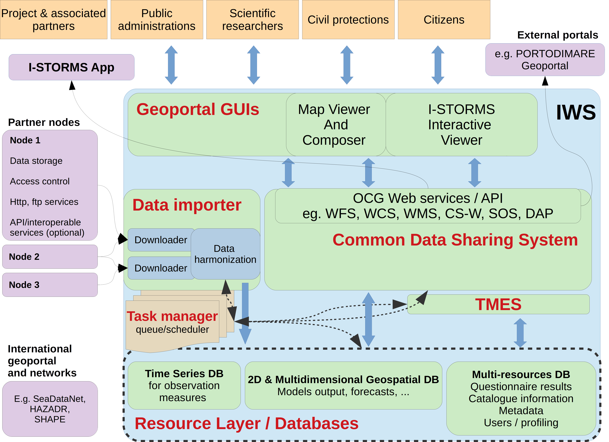

************
The IWS structure
************

The I-STORMS Web System is a combination of a common data system for sharing ocean `measurements <https://iws.seastorms.eu/dashboards/>`_ and forecasts, a `multi-model forecasting system <https://iws.seastorms.eu/tmes/>`_, a `geoportal <https://iws.seastorms.eu/layers/?limit=20&offset=0>`_  and interactive geo-visualization tools to make results available to the general public (`Open I-STORMS <http://www.seastorms.eu>`_). 

Available resources can be accessed simultaneously in an aggregated and standard way. IWS was designed to specifically store, visualize and share the following category of geospatial and informative contents:

 * historical and real-time (or near real-time) time series of observations from fixed-point sensor networks;
 * outputs from existing operational forecast models;
 * localization and description of coastal sea storm events that have damaged the environment, social-cultural and economic assets;
 * bi-dimensional geospatial layers to provide geo-referenced representations of the study area. Such layers are organized in thematic categories (e.g. terrestrial and maritime boundaries, ports, shorelines, morphology and bathymetry, cultural heritage, coastal defence work);
 * datasets, model outputs and time-series metadata to improve discoverability and proper re-use of the shared resources.

The IWS architecture design follows a resource-centred and service-oriented approach. Following the so-called Service-Oriented Geoportal Architecture, the IWS includes three main layers:

 * the resource layer corresponds to the physical storage of the structured information in databases or files;
 * the access layer includes all code and software designed to provide access to the resources in the appropriate format;
 * the Graphical User Interface (GUI) is the client-side component of the Geoportal architecture; the role of GUIs is not limited to the rendering of a given set of resources but also includes the aggregation of relevant resources through lightweight and loosely coupled JavaScript code. In other words, the GUI is not only a presentation layer but also creates a mash-up of relevant resources.

IWS overall architecture is described in the above figure. Furthermore, the schema highlights the user typologies served by the IWS and the interactions/connections with the partner's nodes and with external portals. IWS is structured into six main components: 

 1. the *Resource Layer* for storing the datasets, metadata, resources and all the necessary information. It consists of a combination of different storage solutions in order to support the several and heterogeneous data models and formats shared, and all the information needed to achieve a fully operational infrastructure (e.g. metadata, catalogue information, user accounts and profiles);
 2. the *Data importer* for data ingestion, harmonization, preparation and deposit the datasets in the storage facilities of the Resource Layer. For this purpose, we implemented the use of data servers (e.g. THREDDS, Hyrax) with the advantages that such web systems are open-source and they already implement services like DAP (Data Access Protocol), WCS (Web Coverage Service), WMS (Web Map Service), SOS (Sensor Observation Service); 
 3. the *Transnational Multi-model Ensemble System (TMES)* for collecting and combining the results from existing operational forecast systems;
 4. the *Task Manager middleware* for orchestrating the communication with IWS components (e.g. Data importer, TMES) in order to launch the process (e.g. download the data from the partners’ node), monitor the execution status, and concatenate multiple tasks in a single processing pipeline. The Task Manager middleware supports a time-based job scheduler, synchronous-asynchronous task queue system and a message broker system;
 5. the *Common Data Sharing System* (CDSS) (Access Layer) for publishing the API and the web services to interact (e.g. search, visualize, download, manage) with informative resources through standardized interfaces (e.g OGC-Web service, web API);
 6. the *Geoportal* (Graphical User Interface) for implementing the end-user interfaces and tools to search, visualize, explore and analyse informative resources. The Map Viewer and Composer is an interactive and dedicated GUI for creating, managing and sharing multi-layered maps and for navigating and querying them.

IWS implementation follows a full-fledged Free and Open Source Software (FOSS) approach, in order to foster
transparency, transferability and durability of the system and to be in accord with open source software strategy of the European Commission. IWS provides spatial data infrastructure functionalities for accessing
geospatial layers and forecast model outputs through OGC (Open Geospatial Consortium, http://www.opengeospatial.org/) interoperable services. Such approach is widely accepted and implemented at
European (INSPIRE directive, EuroGEOSS initiative) and global level (GEOSS, Global Earth Observation System
of Systems) to facilitate intergovernmental and inter-agency data exchange and harmonization. Incorporating THREDDS data server, IWS provides access to stored resources also through OPeNDAP and NetCDF standard services and formats. These standards are all products of the scientific communities in oceanography, meteorology and climate sciences and are designed to specifically meet their needs, providing coherent access to a large collection of real-time and archived datasets from a variety of environmental data sources at a number of distributed server site.

