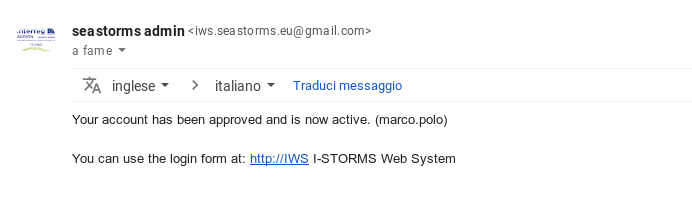
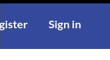
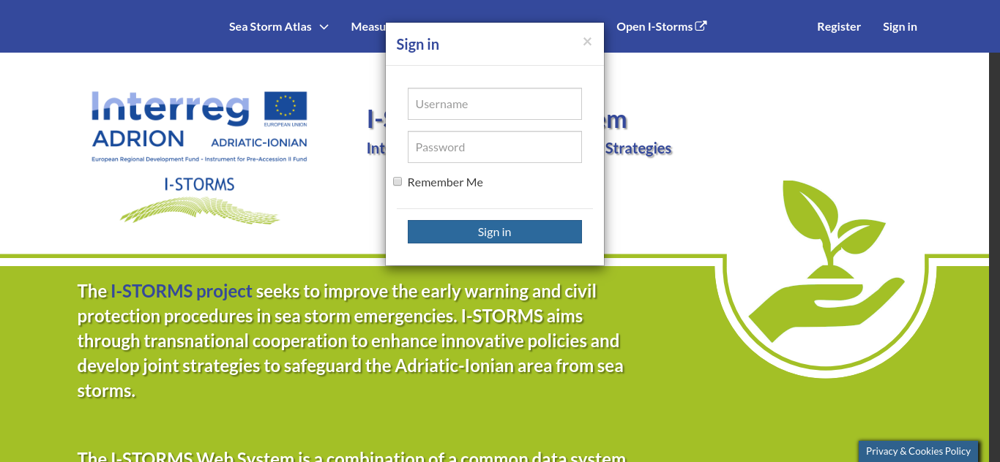
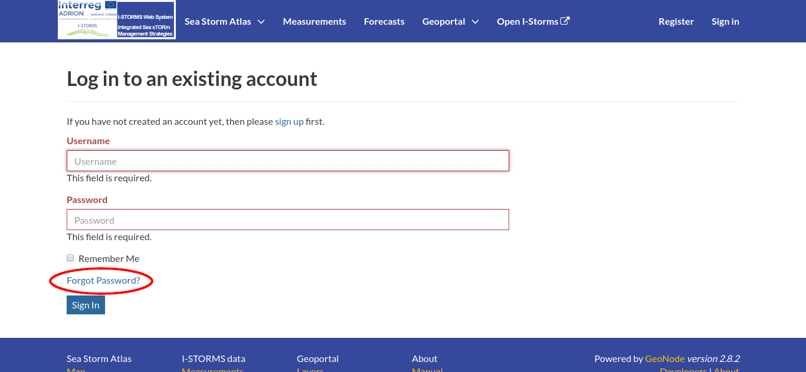
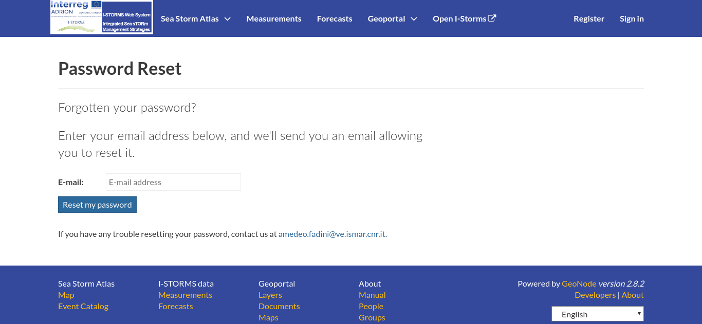
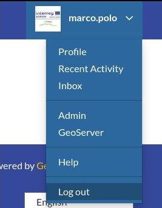

Creating a New Account
======================

On the IWS infrastrcture there are resources avaliable to general public and others that need a user account. You can ask for a user account registering yourself in the platform. The IWS relies on Django allauth account system for account management.

#. From any page in the web interface, you will see a :guilabel:`Register` link. Click that link, and the register form will appear

    .. figure:: img/register_button.png
          :align: center

          *Sign in screen*

#. On the next page, fill out the form. Enter a user name and password in the fields. Also, enter your email address for verification.

   .. figure:: img/register_form.png
          :align: center

          *Registering for a new account*

#. Once you have submitted the registration form an email will be sent to administrators: since the registration in IWS/Geonode is moderated you need to wait until an administrator approve your account. The following confirmation message will appear on the screen:

   .. figure:: img/register_confirmation.png
          :align: center

          *Confirmation Message*

.. note:: Unless you are sure that the administrators already know your email address please send also a personal e-mail to introduce you and provide some information that could help the administrators to assign you to the right group. You can find a contact address on the :ref:`password-reset` page.

#. When your account is approved you'll receive a confirmation email like this:

       *Confirmation Email*

At this point you can login with the username and password that you have inserted during registration step.

How to Log in
-------------

To login click on the :guilabel:`Sign in` link on the top left corner

       *Login link*

You can then insert your username and password on the login form

       *Login form*

.. _password-reset:

How to reset your password
--------------------------

If you have forgot your password, to reach the password reset page you can submit the login form without password and you'll be redirected to the following page:

       *Login Page with forgot password link*

You can then click on :guilabel:`Forgot password?` link.

       *Login Page with forgot password link*

To reset your password simply provide the email address that you used for registration.

How to logout from the system
-----------------------------

To logout click on the :guilabel:`Log out` link of the user menu.

       *Logout link*

You have to confirm this action as described in the picture below.

 .. figure:: img/confirm_logout.png
        :align: center

        *Confirm Log out*

