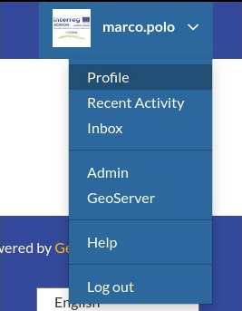
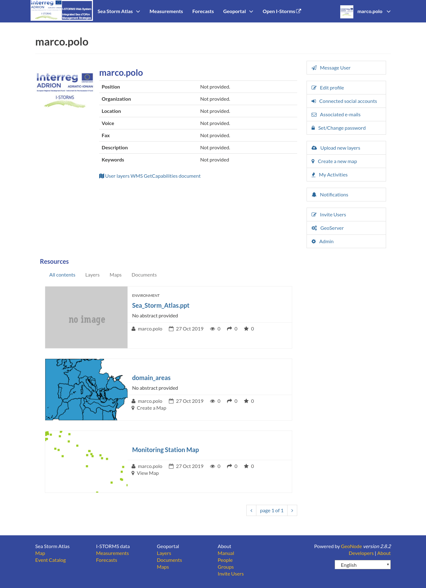

.. _editing-profile:

Updating the Profile
=====================

Once having an account you can enrich your profile with useful information, you can also edit or delete the existing ones.
You can connect the account with your social network, associate many e-mail addresses to it and manage many options such as preferences about notifications.

You can update these information anytime from your *Profile* page, it is accessible from the user menu.

So, click on your user name in the top right of the screen. A drop-down list will show. Click on :guilabel:`Profile` to enter the *Profile* settings page.

     *Link to your profile*

The *Profile* page looks like the one shown in the picture below.

     *User profile page*

Your personal information are shown under the username. At the bottom of the page are listed all the resources associated to your *Profile*, you can decide to view only layers or maps or documents by clicking on the corresponding tab.

T
On the right side of the page there are many useful links to edit personal information, to upload and create layers or maps, to update your *Profile* settings and to get in touch with other IWS users.

We will describe now how to edit your profile and manage your password.

.. toctree::
    :maxdepth: 1

    editing_profile
    managing_password

