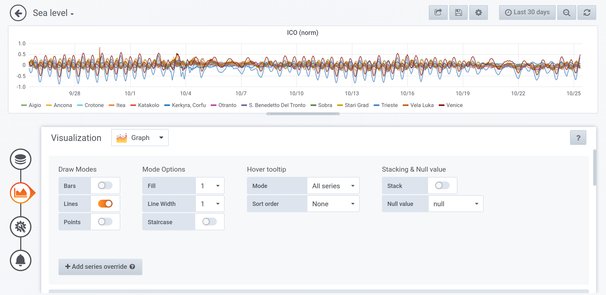

How to customize the dashboards
===============

In addition to default synoptic dashboard, authenticated and
authorized user can create and share their own dashboards.  Grafana
home page, available at `Home Dashboard
<https://iws.ismar.cnr.it/grafana/>`_, is the starting point for
search and visualize already existing dashboard and to create a new
one.

.. image:: image/home_dashboard.png
   :width: 650px
   :alt: home dashboard
   :align: center

Details on how login the first time, create a new dashboard, add
graphs and panels and configure them are available at `Grafana Getting
Started <https://grafana.com/docs/guides/getting_started/>`_
documentation. More details on Graph Panel (the main panel in Grafana)
which provides rich set of graphical options to aggregate and
visualize time series data is available at `Graph Panel
<https://grafana.com/docs/features/panels/graph/>`_ documentation.
Details on PostgreSQL data source that allows you to query and
visualize data from CDSS database is available at `PostgreSQL in
Grafana <https://grafana.com/docs/features/datasources/postgres/>`_
documentation.

Example of Graph Panel editing/configuration graphical user interface.
