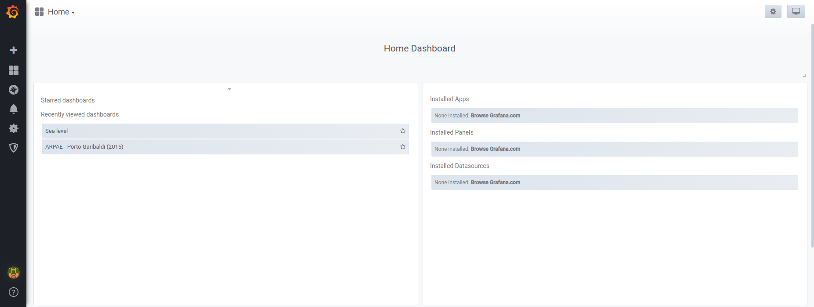

How to customize the dashboards
===============

In addition to default synoptic dashboard, authenticated and
authorized user can create and share their own dashboards.  Grafana
home page, available at `Home Dashboard
<https://iws.ismar.cnr.it/grafana/>`_, is the starting point for
search and visualize already existing dashboard and to create a new
one.

Details on how login the first time, create a new dashboard, add
graphs and panels and configure them are available at `Grafana Getting
Started <https://grafana.com/docs/guides/getting_started/>`_
documentation. More details on Graph Panel (the main panel in Grafana)
which provides rich set of graphical options to aggregate and
visualize time series data is available at `Graph Panel
<https://grafana.com/docs/features/panels/graph/>`_ documentation.
Details on PostgreSQL data source that allows you to query and
visualize data from CDSS database is available at `PostgreSQL in
Grafana <https://grafana.com/docs/features/datasources/postgres/>`_
documentation.

Example of Graph Panel editing/configuration graphical user interface.

The Graph Panel editing and configuration interface provides a preview
of time series visualization graph and four configuration tabs (Query,
Visualization, General, Alert). An example for the Query tab (Visualization
Editor) is shown in the previous figure.

Configuration tabs selector.

Extract data from IWS Measurements
----------------------------------

As previously described, Query Builder provides an high-level
interface for defining the database query and for preparing the data
before their visualization.

As described in the previous figure, query elements are:

:FORM: table or view to query. IWS povides just the
   "measurements_measure_view" which contains all collected
   measurement data.

:Time column: column containing date time value. The
   "measurements_measure_view" contains the "timestamp" column which
   provides date-time values in UTC.

:Metric column: column defining the serie names allowing to plot the
                values as separate series. Metric column is an
                optional parameter. In the example column "location"
                has been used.

:SELECT: statement defining the values to be plotted. In the example
         "value_norm" and aggregate function "avg" have been used.

:WHERE: additional conditions for data pre-filtering. "$__timeFilter"
        is a macros whihch simplify the creation of dynamic query
        applying the time range filter defined by the parent
        dashboard. This is an optional parameter.

:GROUP BY: allows to group data by time or any other columns. This is
           an optional parameter.
