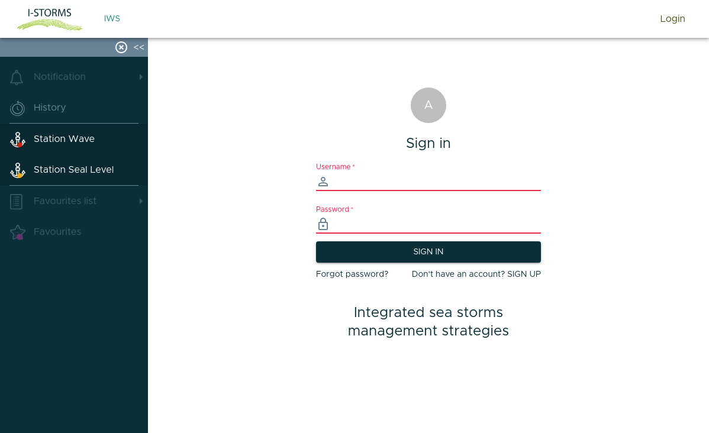
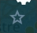
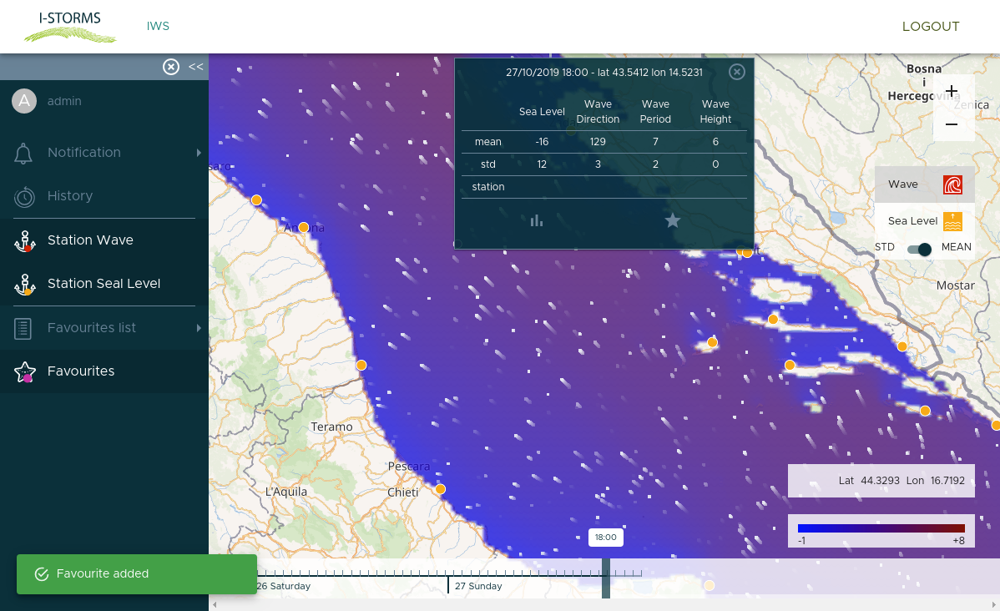

How to customize the platform
=============================

| The Open I-Storms interface is customizable by user
| Is possible to choose favorites point, set up a threshold for sea level and receive notifications about sea level if the forecast predicts a value above your threshold in one of your favorite points.

Login with IWS credentials
--------------------------
By clicking to Login you can register to IWS systems, if you have already your credentials you can login directly.

     *The Login page*

Set up a favorite point
--------------------------

As a registered user when you click somewhere in the map a :guilabel:`Favorite Button` will be |favorite_button|.
By clickin on it the point you have selected will be added to your favorite list.

The threshold for notifications will be managed in the :guilabel:`settings` sections.