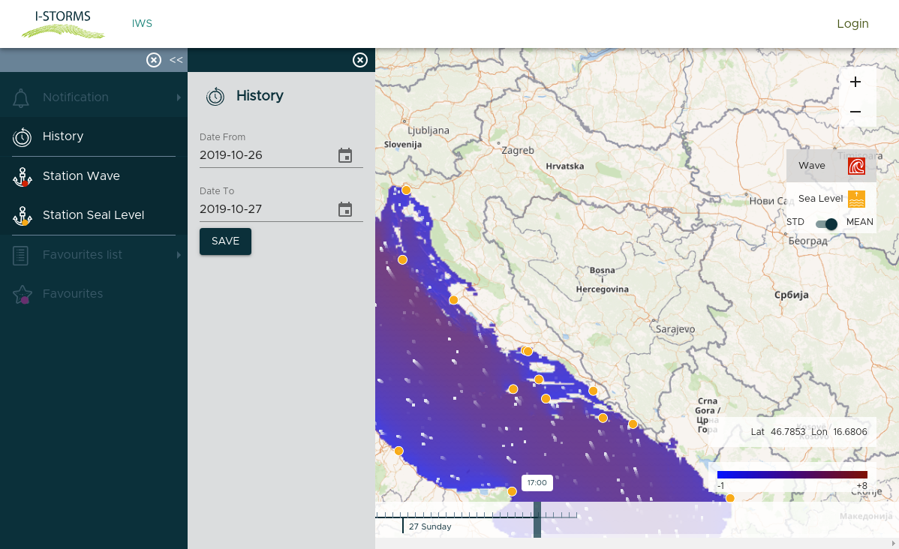

.. _open_istorm_interface:

Open I-STORMS Main Interface
============================

The main interface of Open I-Storms Web Application integrates the visualization of current TMES forecast model output.

    *The Open I-STORMS interface*

The main window shows a Map starting wih sea level mean TMES output for the current hour.
On the map are overlayed the measurements stations locations as  points and queryng a point will output station detail and measurements *[work in progress at 28/10/2019]*

Using the :guilabel:`Time Line` on the bottom of the map you can explore different times of current series.
using the :guilabel:`Layer Switcher` widget on the

The Forecast Time line
----------------------
On the bottom of the map ther is a Time line in which is selected the current time by default.
You can select a different time from Time line and the active layer will change.
By clicking on the :guilabel:`Play` button the map will load in sequence all the forecasts of current time series.

    *The Forecast Time line*

Query TMES forecast
-------------------
To retrieve forecast for a point of the map simply zoom the map to the deired location and click by left mouse button.
A popup will appear with all quantities for the current selected hour in time line:

    *The Information popup*

By clicking the :guilabel:`Graph` Icon |graph_button| you can open the *Graph panel* where is depicted the quantities for that point along all the duration of the current forecast (48 hours). If the selected point has also a station the graph will show also the station data  *[work in progress at 28/10/2019]*.

    *The Graph  window*

The Layer Switcher
------------------

On the layer switcher you can select which forecast show on the map:

 *The Layer  switcher*

Clicking on :guilabel:`Wave` or :guilabel:`Sea Level` entry will toggle from one layer to the other, the active layer is grey and the unactive is white.
The :guilabel:`STD-MEAN` selector will toggle from the mean TMES value to the Standard deviation value for selected layer.

Sea Level Symbology
---------------------------
The Sea Level Mean value is thematized with a color ramp from blue to red for values (in centimeters) below and above the main geodic level

 *The Sea Level Mean Legend*

The Sea Level Standard Deviation represent the spatialized mean error between different models that compose the TMES and has the same unit of measure.

Waves Symbology
---------------
The Waves layers is thematized with a color ramp for the Mean Value and Standard deviation of Wave Significant Height (WSH) where the units are in meters.

 *The Waves Mean Legend*

In addition the wave direction is represented through a dynamic visualization of points moving on the map.

The History Panel
-----------------
On the left panel clicking on the :guilabel:`History` entry you can select different interval of daes/hours to visalize the past forecasts.

        :align: center

    *The History Panel*
