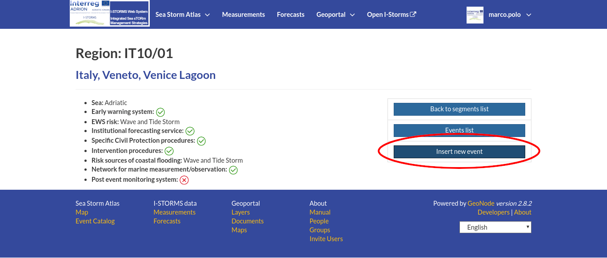
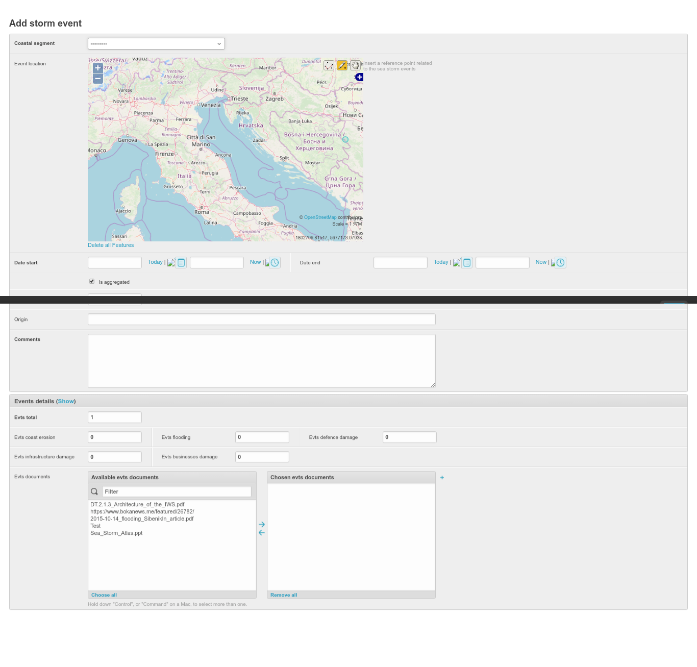
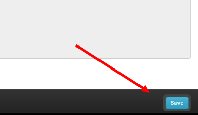

How to add a storm event
========================

If your user belongs to the *Storm Atlas Editor* group you will have the permissions to insert a new event.

From the *Region Coastal segment page* click the :guilabel:`Insert new event` button

    *Add Event Button*

A new window will open with the flllowing page:

    *Add Event Page*

In the Add Event Page you must fill all the mandatory fields

* coastal segment (dropdown list);
* geographic location: insert a point on the map (only for non aggregated events);
* date and time start (mandatory) and Date and Time End (optional) in case of aggregated event these are the first and last day of the year;
* event record is an aggregated record regarding all the event of one year (True/false);
* the flooding level recorded locally;
* for single event: the origin of the event (Storm Surge, Wind Storm etc..);
* a few comments that describe the event or the events of the record;

Event details:

* the total number of the events (for non-aggregated records is always 1);
* the number of events that caused erosion/flooding/damages to defence, infrastructure or business;

Evts documents:

You can link one or more existing documents to the event: first Upload the document following the :ref:`uploading-documents` instructions and then select the documents of your interest from the left list.

When you have finished to insert all data of the event record you need to save with the :guilabel:`Save` button

*The Save button*