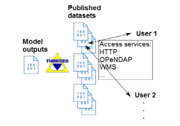

Thredds Data Server
===================

I-STORMS Web integrated System (IWS) uses the Thredds Data Server (TDS) to manage the flow of forecast model outputs, exploiting the several built-in inter-operable access services.

TDS is a web server developed by UNIDATA `https://www.unidata.ucar.edu/software/tds/current/`_ that provides metadata and data access for scientific datasets, using remote data access protocols. It is open-source and based on a simple installation (Java and Apache Tomcat). TDS serves gridded data, especially NetCDF, GRIB, some of the most diffuse formats in operational meteorology and oceanography. TDS is suitable for managing forecast model outputs, observations,  and in the next future in-situ measurements. It allows several access services, among all: HTTP, OpeNDAP, OGC WMS, OGC WCS.
Thredds is based essentially on the catalog, an XML document describing what datasets a server has, how they can be accessed, and in case processes the published dataset. A simple example is shown below:

.. code-block:: xml

<catalog xmlns="http://www.unidata.ucar.edu/namespaces/thredds/InvCatalog/v1.0" >
<service name="odap" serviceType="OpenDAP" base="/thredds/dodsC/" />
<datasetScan name=“Forecast model" path=“fc” location=“/local/data/” serviceName=“odap”/>
</catalog>

TDS publishes the datasets by using the catalog, that can be accessed by the mentioned access services from the final user. The working flow is depicted in the following figure:

    *Thredds Data Server working flow*

TDS is used by IWS to manage the flow of forecast model outputs. Moreover, the data server is used to aggregate successive forecast runs into a unique forecast output, in order to manage specific requests of past forecast outputs by the final user. Different remote catalog can also be federated in order to have a unique dataset catalog.
The underlying TDS of the IWS can be accessed at: `https://iws.ismar.cnr.it/thredds/`_
For the data client there are many advantages, if the TDS technology is exploited. In particular, the user can take only what it needs avoiding to download the entire dataset, it can save space and management costs, and it can have an easier access to the products of interest.
